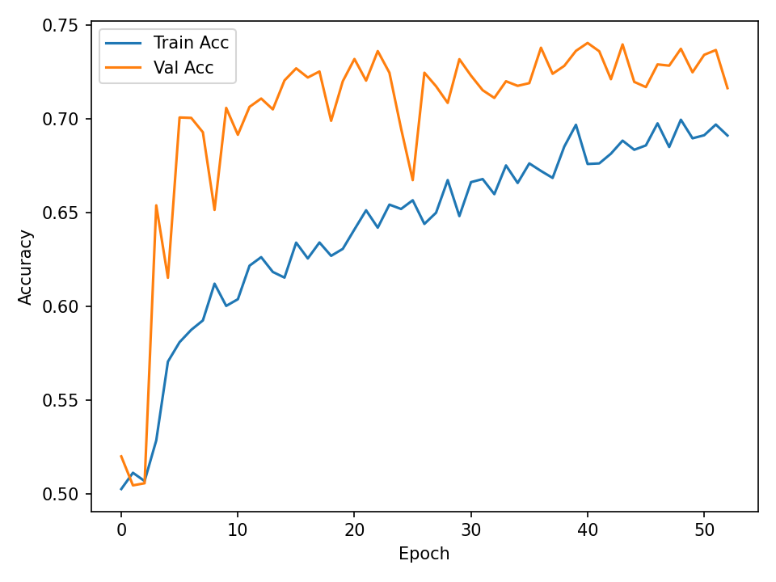
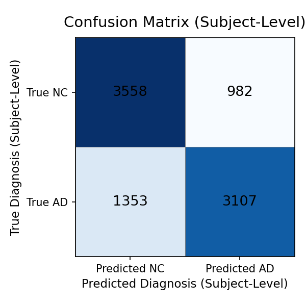
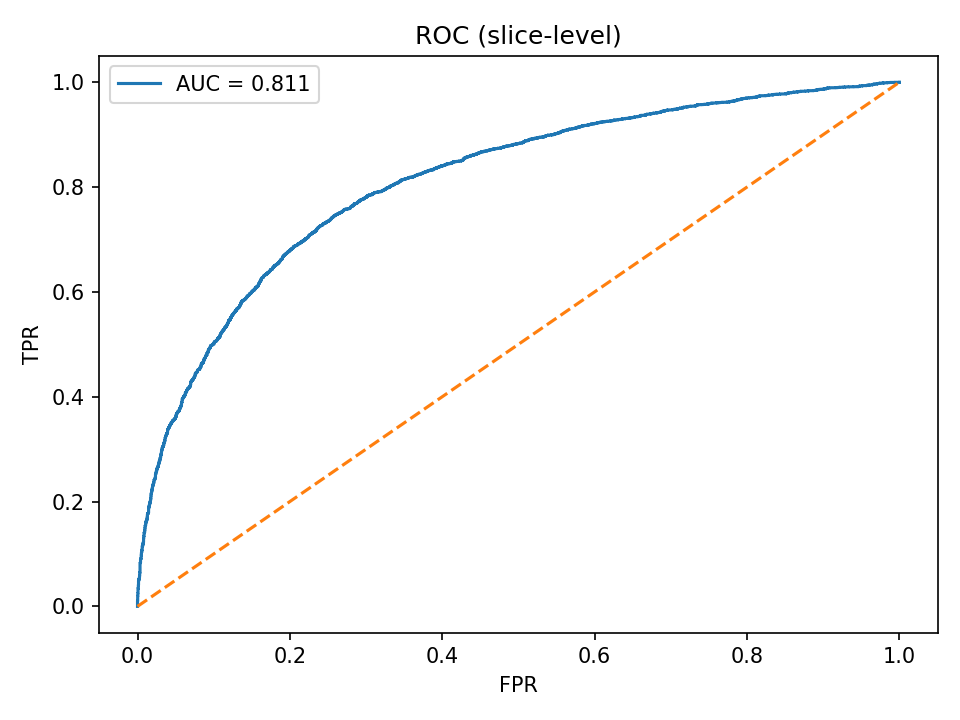
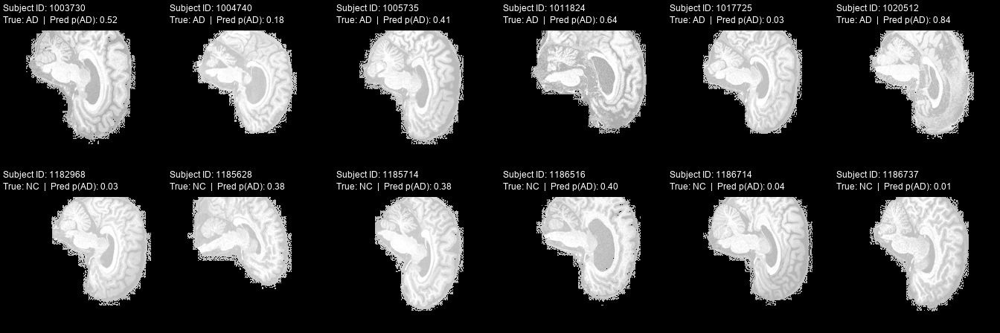

# Alzheimer’s Disease Classification using ConvNeXt on ADNI Dataset

*Author: Man Hin Lai (s47068591)*
*Course: COMP3710 Pattern Analysis* 

## 1. Project Introduction

This project implements a convolutional neural network to classify **Alzheimer’s Disease (AD)** vs **Normal Control (NC)** from grayscale MRI slices . The task is framed as **binary image classification** using a custom, 1-channel variant of **ConvNeXt-Tiny** with training on 2D JPEG slices and subject-level aggregation at evaluation. The pipeline includes robust data augmentation, mixed-precision training, MixUp, weight-decoupled AdamW, warmup+cosine learning-rate scheduling, and early stopping on subject-level accuracy. Inference scripts produce both **slice-level** and **subject-level** metrics and figures suitable for report inclusion.

## 2. Overview

**Data → Model → Metrics**

1. **Dataset (`dataset.py`)**
   * Loads grayscale JPEGs from `ADNI/AD_NC/{train,test}/{AD,NC}/`.
   * Optional cap on slices per subject (`LIMIT_SLICES_PER_SUBJECT`).
   * **Train transforms** : resized crop, flip, affine, perspective, color jitter, Gaussian blur, RandomErasing, normalize.
   * **Eval transforms** : resize + normalize only.
2. **Model (`modules.py`)**
   * **ConvNeXtTiny1C** : ConvNeXt-like blocks (DWConv-7×7 → LN (channels-last) → MLP(×4) → GELU → MLP → LayerScale → DropPath + residual).
   * Stages with depths `[3,3,9,3]` and dims `[96,192,384,768]`.
   * Head: GAP → LayerNorm → Dropout → Linear(1).
   * Trained with **BCE-with-logits** for binary classification.
3. **Training (`train.py`)**
   * **MixUp** in-batch augmentation.
   * **AdamW** (decoupled weight decay), **warmup + cosine** LR schedule.
   * **AMP** (mixed precision) on CUDA.
   * **Early stopping** on *subject-level* accuracy.
   * Saves best checkpoint to `runs/best_model.pt` and training curves (`loss_curve.png`, `acc_curve.png`, `subject_acc_curve.png`).
4. **Inference / Report Artifacts (`predict.py`)**
   * Loads the test split and the trained checkpoint.
   * Computes **slice-level** and **subject-level** metrics (Acc, AUC, Sensitivity, Specificity).
   * Saves: confusion matrix, ROC curve, subject example grid, and a metrics JSON.

---

## 3. Pre-Processing & Splits

**Pre-processing:**

* All images are **grayscale** and resized to `IMAGE_SIZE=224`.
* **Normalization** : mean=0.5, std=0.5 (single channel).
* **Train-time augmentations** (dataset-level): random resized crop, horizontal flip, small affine transforms, perspective jitter, brightness/contrast jitter, Gaussian blur, and RandomErasing. These are standard modern augmentations for CNNs to improve generalization on limited medical imaging datasets.
* **Train-time MixUp** (model-level): linear combination of two samples and labels within a batch (α=0.2), which smooths decision boundaries and reduces overfitting.

**Split justification:**

* The **provided folder structure** separates `train/` and `test/`. We strictly train on `train/` and treat `test/` as **held-out evaluation** (used for validation during development and for final reporting).
* Subject leakage is mitigated by dataset naming (subject ID parsed from filename prefix) and optional `LIMIT_SLICES_PER_SUBJECT` to avoid overpowering the batch with many slices from the same subject. At evaluation, we compute metrics at **slice-level** and **subject-level** (by averaging slice probabilities per subject), with the **subject-level** metric used for model selection.

---


## 4. Results

Training was performed on a local GPU with the default config. The best checkpoint (by subject-level accuracy) achieved approximately:

* **Slice-level accuracy** : **0.741**
* **Subject-level accuracy (best)** : **0.802**

Slice level accuracy, loss, and subject level accuracy curves are saved in runs/ after running train.py

**Examples of these curves:**

Subject level accuracy:


Slice level accuracy:


---

## 5. Visualizations

Predictions on the test split of the data, using the trained model are visualized as:

* **Confusion Matrix (Subject-Level)**
* **ROC Curve (Slice-Level)**
* **Subject Examples Grid** (representative slice per subject with subject-level p(AD))

These results will be saved in runs/ after running predict.py

**Examples of these visulizations:**

Subject level confusion matrix:


Slice level ROC curve:


Examples of: Input | True label | Model prediction(with percentage)



---

## 6. Dependencies and Environment

| Package      | Version        | Purpose                 |
| ------------ | -------------- | ----------------------- |
| Python       | 3.11.9         | Environment             |
| PyTorch      | 2.5.1 + cu124  | Deep learning (GPU)     |
| Torchvision  | 0.20.1 + cu124 | Model zoo / transforms  |
| Scikit-learn | 1.4+           | Metrics / preprocessing |
| Matplotlib   | 3.8+           | Plotting                |
| Pillow       | 10.3+          | Image utilities         |
| numpy        | 1.26+          | Maths calculations      |

These Dependencies are listed in requirements.txt


---

## 7. Reproducibility

All results were obtained on Windows 10 + RTX 4070 Ti (CUDA 12.4 build).
To replicate:

```bash
python -m venv .venv && .venv\Scripts\activate
pip install -r requirements.txt
python recognition\adni_convnext_47068591\train.py --root \home\groups\comp3710\ADNI\AD_NC
python recognition\adni_convnext_47068591\predict.py --root \home\groups\comp3710\ADNI\AD_NC ----ckpt runs/best_model.pt
```

These following configs can also be changed in train.py:

* `ROOT`, `EPOCHS`, `BATCH`, `LR`, `WEIGHT_DECAY`
* `IMAGE_SIZE`, `LIMIT_SLICES_PER_SUBJECT`
* `DROP_PATH_RATE`, `HEAD_DROP`, `WARMUP_EPOCHS`
* `CLIP_NORM`, `MIXUP_ALPHA`
* `EARLY_STOP_PATIENCE`
